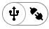
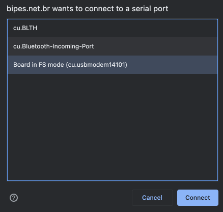
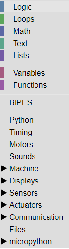
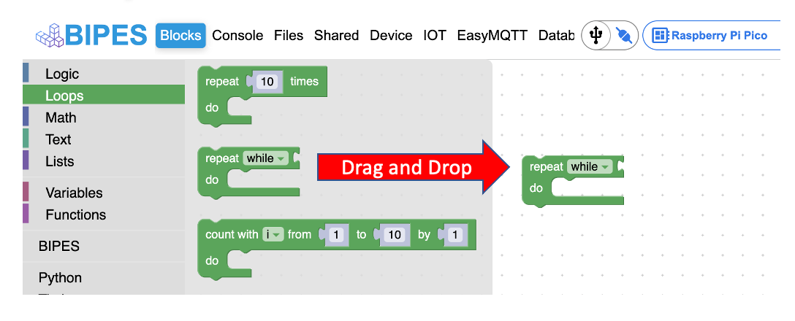
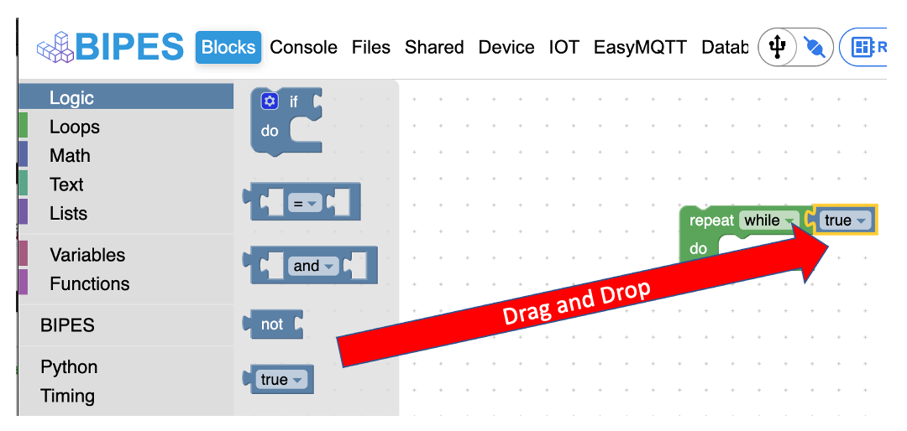

# Getting Started

Before getting started with BIPES, follow the directions below to setup your microcontroller.

## Setup

However, before getting started with BIPES, your microcontroller board must be setup.  Regardless of which board you are using, you should start by doing the following steps:

- Download the [flash_nuke.utf](https://datasheets.raspberrypi.com/soft/flash_nuke.uf2) file to your computer.

- Download the latest [MicroPython utf](https://micropython.org/download/rp2-pico/rp2-pico-latest.uf2) file to your computer. 

- Hold down the BOOTSEL button on the Pico or the BOOT button on the Maker Pi then connect your microcontroller board to your computer with a micro usb cable and it will appear as a drive onto which you can drag the flash_nuke.uf2 file

    - If you don't see the Maker Pi board, make sure the on/off switch is in the on position before connecting to your computer.

- Once the drive reappears, copy the MicroPython utf file to your device.

If you are having trouble, take a look at the [Drag-and-Drop MicroPython page](https://www.raspberrypi.com/documentation/microcontrollers/micropython.html#drag-and-drop-micropython)

## Working with BIPES

 Working with BIPES is easy, since there is nothing to load on your computer. [BIPES can be found online](https://bipes.net.br/pico/ui/).  Once the Welcome screen loads in your browser, you can do the following:

 - Close the Welcome screen
  
  There are two configurations you must change.  Your serial port and device.

  

- Connect to your device

    - Serial connection 

On the Mac, the Pico will connect to a port in the ```/dev/``` directory such as:

```/dev/cu.usbmodem140101```
    - 

    - Select the comm port for your board

 - Select your device:

    - The Raspberry Pi Pico 
    
    - The Maker Pi RP2040 


- The left navigation pane contains all of the blocks you will need to run the examples for the Raspberry Pi Pico and the Maker Pi RP2040 microcontrollers.



## Using the BIPES Drag and Drop Interface

### Adding a loop





## Test Your Connection

The best way to test your connection is to write a small program that will flash the on-board LED.  See the basic blink example under Raspberry Pi Pico.


- Congratulations!  You are ready to start using BIPES.
