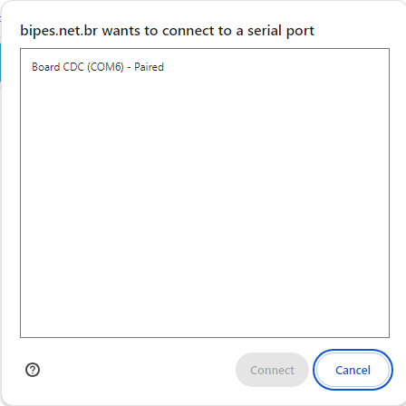

# Working with BIPES

 Working with BIPES is easy, since there is nothing to load on your computer. [BIPES can be found online](https://bipes.net.br/pico/ui/).  Once the Welcome screen loads in your browser, you can do the following:

 - Close the Welcome screen
  
 - There are two configurations you must change.  Your serial port and device.

  

 - Connect to your device

    - Serial connection 

        - On the Mac, the Pico will connect to a port in the ```/dev/``` directory such as: ```/dev/cu.usbmodem140101```

        

        - On the PC, the Pico will connect to a comm port

        


    - Select the comm port for your board

 - Select your device:

    - The Raspberry Pi Pico 

    - The Raspberry Pi Pico W 

    - The Maker Pi RP2040 

    - The Maker Nano RP2040 


- The left navigation pane contains all of the blocks you will need to run the examples for the Raspberry Pi Pico and the Maker Pi RP2040 microcontrollers.


## Using the BIPES Drag and Drop Interface

### Adding a loop


## Test Your Connection

The best way to test your connection is to write a small program that will flash the on-board LED.  See the basic blink example under Raspberry Pi Pico.


- Congratulations!  You are ready to start using BIPES.
