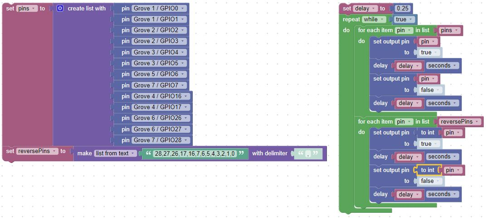
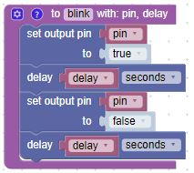

# Blink in BIPES

## Overview
In this lab, we will use BIPES to make the blue on-board LEDs on the Maker Pi blink on and off every half second.  The only things you need to run this program are

1. BIPES
2. a USB cable
3. a Maker Pi RP2040 microcontroller

## Blinking the Builtin LEDs

The maker pi has thirteen built in blue LEDs wired to logical pins.  Here is a sample program that you can use.  Don't worry about understanding each block yet.  We will cover the various parts in later sections.

Take a look at the left navigation.  Each section in the navigation contains different items that you will use to run your program.  We used blocks from _Loops_, _Logic_, _Machine:In_Out Pins_, and _Timing_.

The green block comes from the _Loops_ navigation section.  Anything inside the green block repeats _while true_. _true_ comes from the _Logic_ navigation section. Thus the program will run forever, or until we stop it.  The first blook inside the loop comes from the _Machine:In/Out Pins_ navigation section.  We are setting the onboard LED to _true_ (on).  The next block is a delay for 1/2 second.  The delay comes from the _Timing_ navigation section.  We repeat those two blocks, this time setting the onboard LED to _false_ (off).

## Changing the Blink Speed

Next, lets create a variable from the _Variable_ navigation section for the delay that the LED is on and off.  The number in the delay block comes from the _Math_ navigation section.

This program will blink the built-in LED on and off every 1/4 of a second.  By changing the delay variable you can make the LED blink faster and slower.

!!! Challenge
    What is the fastest you can make the LEDs blink and still see them changing?  What does this tell you about the human eye?
