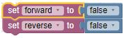
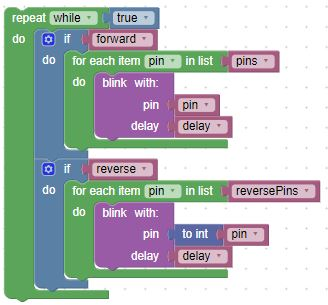
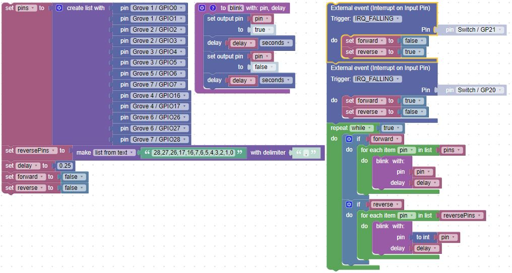

# Buttons, Interrupts, and Functions in BIPES

## Overview
In this lab, we will continue to use BIPES to make the blue on-board LEDs on the Maker Pi blink on and off every quarter second.  The only things you need to run this program are

1. BIPES
2. a USB cable
3. a Maker Pi RP2040 microcontroller

## Still Blinking the Builtin LEDs

We want ot take advantage of BIPES ability to allow us to define our own functions.  So we will use that to create a function to turn an LED on, wait a predetermined amount of time (delay), then turn the LED off, and again wait that same time before return to the calling program.

Next, let's create a pair of variables to determine if which direction the LEDs will sequence, forwards or backwards.  Initially, we don't want to have the LEDs blink at all, so we'll set the variables to false.

Then, we can set up interrupts to capture when a button is pressed on the Maker Pi board, indicating the direction to sequence the LEDs.

And finally, the main loop.  It is similar to the previous example; however, there are two added if blocks to determine the sequence direction.

Putting it all together allows us to sequence the LEDs in one direction, once one button is pressed, then sequence in the opposition direction when the other button is pressed.

!!! Challenge
    Can you make the sequence change direction in the middle of a run, rather than waiting for the sequence to complete?
