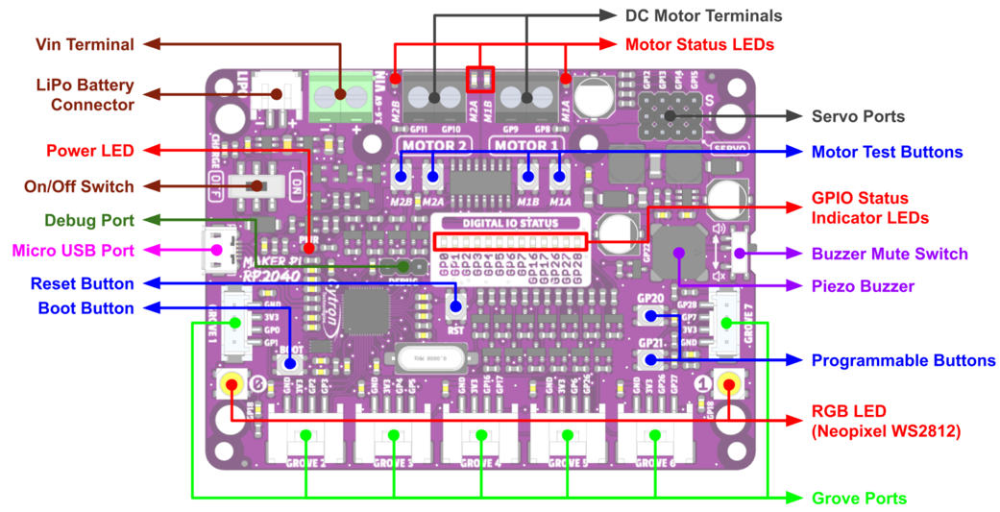
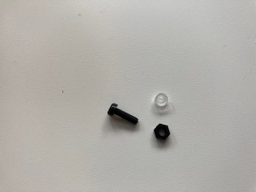

# Building the OptumBot remote control car with the Maker Pi RP2040

The bot brain is the Maker Pi RP2040.  The Maker Pi board makes building a bot simple, since it is a one board solution built around the RP2040.  The board comes with a dual channel DC motor driver, four servo motor ports, seven grove ports, a piezo, and two multi color leds. 

[Maker Pi RP2040 Information](https://www.cytron.io/p-maker-pi-rp2040-simplifying-robotics-with-raspberry-pi-rp2040)

 **The parts kit includes:**

 

 Description | Part 
---------|----------
Chassis kit | 
Maker Pi RP2040 | 
HC-05 or AT-09 Bluetooth module | 
Ultrasonic sensor and mount | 

Additional parts (not included in the kit):

- Nuts, bolts, and spacers
- Wire ties to secure wires
- Four AA batteries
- USB Micro B Cable

 **Additional software required:**

- Software capable of connecting to and writing to the bluetooth module (I'm using LightBlue)

**Assemble the chassis**

Place the Maker PI RP2040 board on the rear of the chassis as shown and mark the small holes that are in each corner.  Make sure the back of the board is closer to the back of the chassis, since the motors will end up close to the front board mounts.

Once the holes are marked, drill the holes, using an 1/8 inch drill bit.  Be careful, as your mounting holes may be close to existing mount holes in the chassis.  Also note that the chassis is thin plastic, so it must be supported as you drill through it.

After the holes are drilled, remove the paper from the chassis, motor mounts, and sensor mount.  All parts should be clear plastic after the paper is romoved.

Gather the wheel, motor, mounts, long screws, and nut as shown above.  Slide the motor mounts through the chassis, then insert and secure the motor with the screws.  Note that the wires will seperate from the motor if not handled with care.  The wires should be on the side of the motor that faces out from the chassis.  Once the motor is mounted, feed the wires through the chassis and optionally secure them with a wire tie.

Add the wheel once the motor is mounted and repeat for the other side.

The battery holder is mounted on the bottom of the chassis, nestled between the motors.  The wires from the battery holder should feed to the rear of the chassis.

Assemble the rear wheel by adding the standoffs to the castor wheel as shown in the above left image.  Then attach it to the chassis.  The wires for the battery holder are shown feeding through the hole to the left of the motor wires.  They will need to be fed through the right side (assembler error).

Feed the screws up through the bottom of the chassis in the holes that were drilled.  Use the plastic spacers to separate the board from the chassis (and clear the wires), then secure the board with the nuts.  The board should be mounted such that the connections to the motor and battery wires face the rear of the chassis.  The wires can now be trimmed and attached to the board.  Carefully note that the black battery wire connects to the negative (-) green terminal and the red battery wire attaches to the positive (+) green terminal.  The motor wires should connect to the black terminals, with the black wires on the outside (terminals labeled GP8 and GP 11) and the red wires on the inside (terminals labeled GP 9 and GP 10).

**Connecting the ultrasonic sensor**

Insert the ultrasonic sensor in the mount with the pins up (it will appear as if the sensor is mounted upside down, well it is).  Then attach the mount to the front of the chassis with the short screws.  The ultrasonic sensor measures distance using sonar, an ultrasonic (well above human hearing) pulse (~40KHz) is transmitted from the unit and distance-to-target is determined by measuring the time required for the echo return.  The pins are labeled on the front of the module - Vcc  (3.3 VDC), Trig, Echo, and Gnd.

Connect the grove connector wires as follows:

Wire Color | Sensor Pin
---------|----------
Red | Vcc
White | Trig
Yellow | Echo
Black | Gnd

Connect the other end of the grove wire harness to the grove 5 port.  Use small wire ties to keep the wires secure.

**Connecting the bluetooth module**

The bluetooth module will nestle between the wire ties used to tidy up the wires.  The bluetooth modules communicate at 9600 baud by default, although some older modules use 115200 baud.  Communication is done through the built in UART on the board.  The settings (baud rate, name, etc.) can be changed by sending AT commands to the module.  Sending "AT+HELP" to the module will return a list of supported commands.

The AT commands for getting/setting baud rate are:

Send | Receive | Parameter
---------|----------|---------
 AT+BAUD? | OK+Get:[P1] | P1: Baud Rate
 AT+BAUD[P1] | OK+Set:[P1] | 0: 9600; 1: 19200; 2: 38400
 . |  | 3: 57600; 4: 115200; 5: 4800
 . |  | 6: 2400; 7: 1200; 8: 230400
 . |  | Default: 0 (9600)

The pins are usually labelled on the back of the module.  Your module with either have six or four pins.  Ignoring the outer most pins (assuming your module has six pins), the pins from left to right as you look at the back of the board are VCC (3.3 VDC), Gnd, Tx, & Rx.  Connect the grove connector wires as follows:

Wire Color | Module Pin
---------|----------
Red | VCC
Black | GND
Yellow | TXD
White | RXD

Connect the other end of the grove wire harness to the grove 3 port.

N.B.: If you are using an Apple device to communicate with the bluetooth module, you must use the AT-09 module.  Apple does not support the HC-05 bluetooth version.
