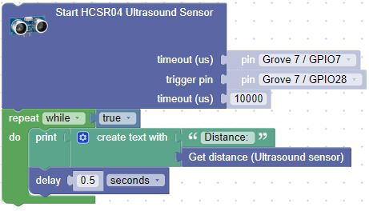
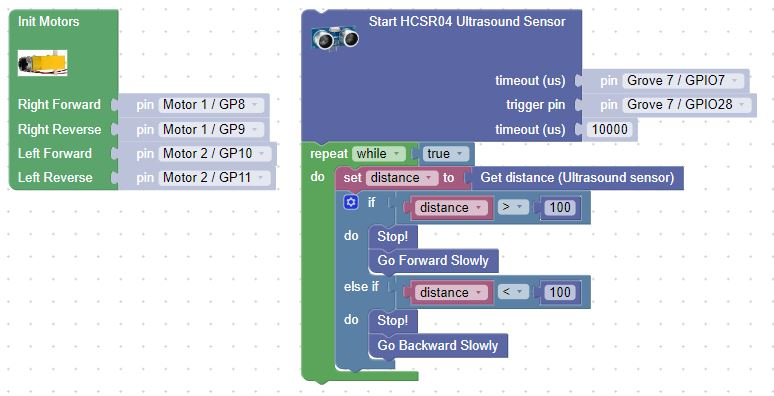

# Add an ultrasonic sensor and follow your hand

## Add an ultrasonic sensor to your chassis

Once you added the sensor, build the blocks to initialize the sensor and display the distance reading in the console.  As you run the program, move your hand in front of the chassis such that the distance changes.  Note that your sensor may be connected to a different Grove connector.

## Now add the motor control

Once you add the motor control, where do you think the sweet spot is such that it follows your hand as you move your hand away from and towards the sensor?  We picked 100, but you may decide to move the threshold.

