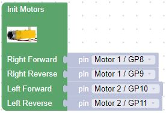
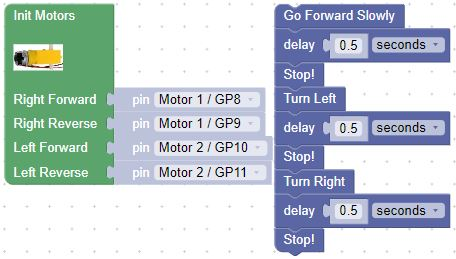

# Working with Motors in BIPES

## Assemble the Two Wheel Smart Car Chassis

Before we work with motors, we'll want to assemble the smart car chassis.  It is available from a number of vendors online.

* [Cytron 2WD Smart Car Chassis](https://www.cytron.io/p-2wd-smart-robot-car-chassis)
* [YouTube Video of Assembly](https://www.youtube.com/watch?v=H78t6dnSoG0) - note that he does not remove the backing paper on the Plexiglass and he mounts the battery on the top.  We like ours on the bottom so we can mount the Maker Pi board on top.

## Check your motor wiring!

Depending on how your motors are wired, you may need to change the motor initialization block from the displayed block below:

The wiring can be tested by trying the motor movement blocks (forward, left, and right)

If the car doesn't move in the direction(s) you expect, you will need to change the initialization block until the car moves correctly.

!!! Challenge
Can you make the car travel in a square, ending up where it started?
