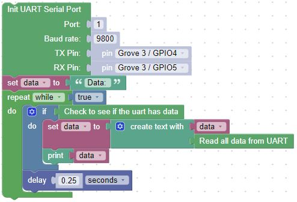
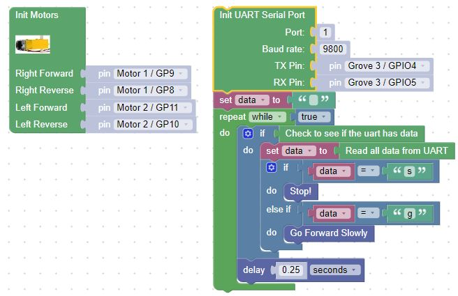

# Reading from the UART

## Add a bluetooth module to your chassis

Once you added the module, build the blocks to initialize the uart and display the data that you sent to the module.  Note that the bluetooth module is connected to UART on Port 1 with a baudrate of 9600 baud.  You'll need to use software on you phone, tablet or computer to send data to the bluetooth module.  If you are using LightBlue, open the application and find the bluetooth module.  Selecting the module will take you to the next screen with device information.  Selecting the Characteristic section will allow you to write to the module.  Change the data type from Hex to UTF-8.  Then write a new value and send it.

## Now add the motor control

Once again, add the motor control.  Now make the car move forward and stop as you send commands to the module.

!!! Challenge
Can you make the car travel in other directions?
