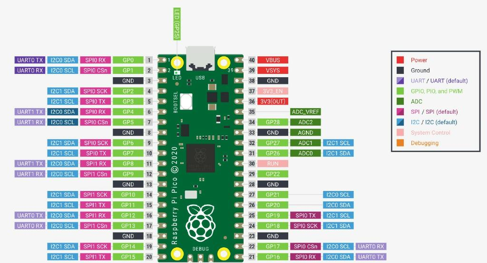

# Introduction to using a Raspberry Pico with BIPES

These lessons assume that you have at least skimmed the [Getting Started](http://www.coderdojotc.org/micropython/getting-started/01-intro/) sections and have selected the Raspberry Pi Pico in BIPES to write your code.

The lessons will introduce you to using BIPES with the Raspberry Pi Pico.

The Pico (shown below) has 28 general purpose (GP) pins.  Those pins can be used for a variety of functions.  We will be exploring thos functions in the subsequent labs.

The first example just uses the Raspberry Pi Pico and its internal LED. All the subsequent examples will require you to place components on a solderless breadboard.