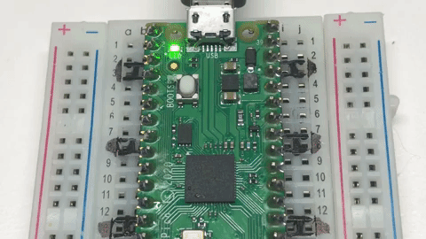
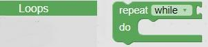
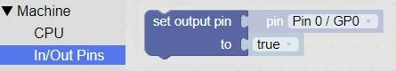
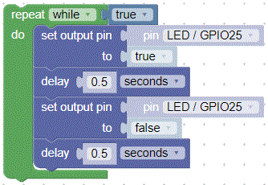
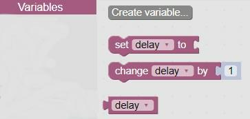
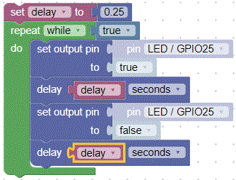

# Blink in BIPES

## Overview
In this lab, we will use BIPES to make the green on-board LED on the Raspberry Pi Pico blink on and off every half second.  The only things you need to run this program are

1. BIPES
2. a USB cable
3. a Raspberry Pi Pico microcontroller

## Finding the Blocks

Take a look at the left navigation.  Each section in the navigation contains different items that you will use to run your program.  We will use blocks from _Loops_, 

 

_Logic_,

 

_Machine:In/Out Pins_ (Change the pin to LED / GPIO25),

 

and _Timing_ (Change the delay time to .5) sections.

 

## Blinking the Built in LED

The pico has a single built in green LED wired to logical pin 25.  We call this GPIO 25.  GPIO means General Purpose Input and Output pin. Here is a sample set of blocks that you can use.  Don't worry about understanding each block yet.  We will cover the various parts in later sections.

Anything inside the green block repeats _while true_. Thus the program will run forever, or until we stop it.  We are setting the onboard LED to _true_ (on).  The next block is a delay for 1/2 second.  We repeat those two blocks, this time setting the onboard LED to _false_ (off).

## Changing the Blink Speed

Next, lets create a variable from the _Variable_ navigation section for the delay that the LED is on and off.   Click on the Create variable... block to create a variable named _delay_. 

 

Once the delay variable is created, new blocks will be created in the _Variable_ navigation section

 

The number in the delay block comes from the _Math_ navigation section.

 

Now we can change the blink speed easily, by only changing the value of the delay variable.

This program will blink the built-in LED on and off every 1/4 of a second.  By changing the delay variable you can make the LED blink faster or slower.

!!! Challenge
    What is the fastest you can make the LED blink and still see it changing?  What does this tell you about the human eye?
