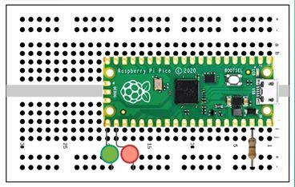
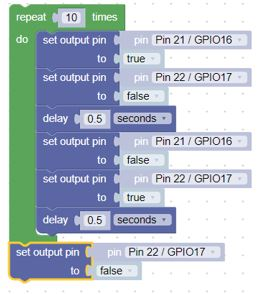

# Blink in BIPES

## Overview
In this lab, we will use BIPES to make the green on-board LED on the Raspberry Pi Pico blink on and off every half second.  The only things you need to run this program are

1. BIPES
2. a USB cable
3. a $4 Raspberry Pi Pico microcontroller

## Blinking the Builtin LED

The pico has a single built in green LED wired to logical pin 25.  We call this GPIO 25.  GPIO means General Purpose Input and Output pin. Here is a sample program that you can use.  Don't worry about understanding each block yet.  We will cover the various parts in later sections.

Take a look at the left navigation.  Each section in the navigation contains different items that you will use to run your program.  We used blocks from _Loops_, _Logic_, _Machine:In_Out Pins_, and _Timing_.

The green block comes from the _Loops_ navigation section.  Anything inside the green block repeats _while true_. _true_ comes from the _Logic_ navigation section. Thus the program will run forever, or until we stop it.  The first blook inside the loop comes from the _Machine:In/Out Pins_ navigation section.  We are setting the onboard LED to _true_ (on).  The next block is a delay for 1/2 second.  The delay comes from the _Timing_ navigation section.  We repeat those two blocks, this time setting the onboard LED to _false_ (off).

## Changing the Blink Speed

Next, lets create a variable from the _Variable_ navigation section for the delay that the LED is on and off.  The number in the delay block comes from the _Math_ navigation section.

This program will blink the built-in LED on and off every 1/4 of a second.  By changing the delay variable you can make the LED blink faster and slower.

!!! Challenge
    What is the fastest you can make the LED blink and still see it changing?  What does this tell you about the human eye?

### Blinking external LEDs
Although the builtin LED is convenient, you can use the code to blink any number of external LEDs that are connected through a 330 ohm resister in series to the LED.

Hints:

- We will assume that LEDs are connected to pins GPIO16 and GPIO17 and are connected via a 330 ohm resistor to ground.
- The longer lead on the LED is the Anode (+) lead, connect it to the GPIO pins on the pico
- Modify the first program
- Note which GPIO pins are connected to each LED

Here are the blocks that will blink the LEDs that are connected to GPIO16 & GPIO17 time 10 times, then turn off the remaining lit LED.

