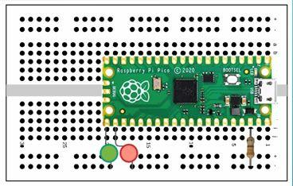
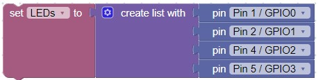
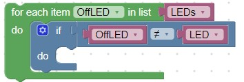

# Blinking external LEDs
Although the builtin LED is convenient, you can use the code to blink any number of external LEDs that are connected through a 330 ohm resister in series to the LED.

We will need to use the breadboard for this lab.  If the Pico isn't already inserted into the breadboard, do so now.  Pin 1 (Top left pin) should be inserted into c1 of the breadboard.

Hints:

- We will assume that LEDs are connected to pins GPIO16 and GPIO17 and are connected via a 330 ohm resistor to ground.
- The longer lead on the LED is the Anode (+) lead, connect it to the GPIO pins on the Pico
- Modify the first program
- Note which GPIO pins are connected to each LED.  They should be the two bottom pins on the right side.

Here are the blocks that will blink the LEDs that are connected to GPIO16 & GPIO17 10 times, then turn off the remaining lit LED.  Note that we are using a different loop block from the _Loops_ navigation section.  This loop block allows us to determine a set number of times that the code inside the loop will be executed.

!!! Challenge
    Can you use a List with a Loop and Logic to make a set of 4 LEDS blink in sequence?

    Hints:
    
    - Create a List block with the pins that connect to the LEDs.  Note: You can use the settings gear  to change the number of list items.

    

    - Use the "for each item in list" Loop block to select the LED to turn on

    
        
    - Use a second "for each item in list" Loop block with a conditional Logic block to turn off the other LEDs

    
