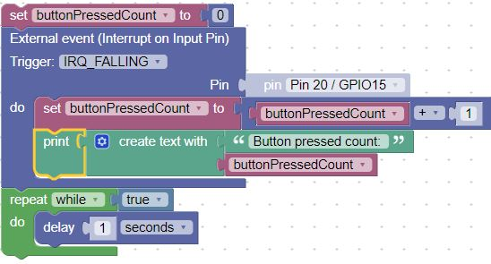
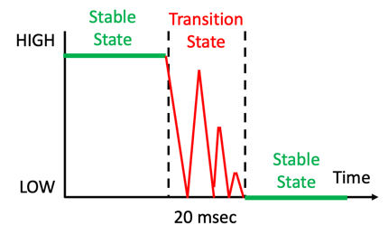
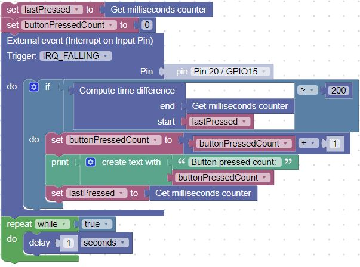

# Interrupt Handler Version

Although the polling version is simple, it does take a lot of the CPU resources.  The button.value() is checked 10 times a second, even though the button might only be pressed once a day!

A more efficient version uses a strategy called an [interrupt handler](../advanced-labs/02-interrupt-handlers).  This is a function that is "registered" by micropython to handle external events such as a button press.

You can see the count of button presses in the console.

## Interrupt Handler with a Debounce Feature

One of the problems with most switches is that they don't turn on and off perfectly each time.  As the connection is getting close to closing some electrons jump the gap and the switch appears to turn on for a few microseconds.  So to a computer, this looks like someone quickly pressing a button rapidly until it is firmly closed or completely open.  This intermediate stage between completely open and closed is called the "bounce" stage of a switch opening and closing.

To remove this problem and get a clean signal, we can use either a hardware solution (wiring a capacitor to remove the high frequency noise) or we can be clever and solve the problem with a few extra lines of code.

The secret is to setup a timer when the switch is first closed or opened.  We then ignore all the crazy stuff that happens for about 1/5th of a second (200 milliseconds).  By then we usually have a solid indication that the button is changing state and we can return the new value.

Here are the blocks of this "Debounce" code:

