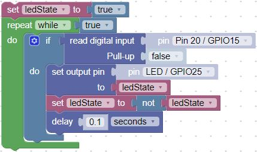

# Polling for a Button Press

Think about sending your friend a text on your phone.  Now look at your phone every couple of seconds, checking to see if your friend responded.  That is similar to polling.  In this case, the Pico checks the input pin to determine if voltage is applied.  If it detects the input being pulled high, it changes the LED state and waits for the nexst time the input pin is pulled high.

## Sample Button Polling Code

Here is our fist example that uses a simple "watching" loop to check if the button value has changed 10 times per second.  In this case, the built-in LED is connected to pin 25.

