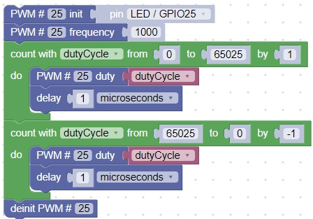

# Fade an LED in and Out 

In the prior Blink labs, we turned LEDs on an off at different speeds.  But what if we want to slowly turn on our LED on and off?  In this lab we will show you how to dim your LED to any brightness level you want.

## Welcome to Pulse Width Modulation (PWM)

Although digital computers are good at quickly turning signals on and off, they don't really allow us to easily set an output to a given voltage level without complex circuits.  But there is an easier way to adjust the brightness of an LED!  We can quickly turn the signal to the LED on and off.  We can do this so quickly that you can't even see it flicker.  Controlling the amount of time a signal is on is all about controlling the width of the ON pulse.  That is why this is called Pulse Width Modulation or PWM for short.

We can think of the voltage at a pin being on (True) or off (False) as being part of a square wave.  The top of the square wave represents the voltage being on and the bottom of the square wave represents teh voltage being off.

With a PWM design there are two things we need to tell the microcontroller:

1. How often do you want a square wave to go on and off?  The rate of change of the pulse is called the frequency.
2. How wide should the on part of the pulse be (relative to the total width).  This is called the duty cycle.

A GPIO pin is declared a PWM output when you use the PWM block found in the _Machine: In/Out Pins_ navigation section.  The block initializes a pin to be a PWM pin.  Frequency and duty cycle can then be set individually.  Conversly, the RPI PWM block lets you set both the frequency and duty cycle when the pin is initalized.

Note that we can slow the frequency way down and the dimming effect will still work.  As an experiment you can change the PWM frequency to around 20 and you will see a distinct flicker as the LED turns on.

Here is the sample set of blocks that will slowly brighten, then dim the built in LED that is on pin 25:

Note that the duty cycle starts at 0 (always off) and moves slowly up to 65,025 (always on).  It then does the reverse and slowly dims the LED and then repeats.  There is only a 1 microsecond of a delay between these changes so the LED will completely turn on in about 8.5 seconds before it starts to dim again.

!!! Challenge
    1. Change the frequency from 1,000 to 500, 100, 50, 40, 30, 25, 20, and 10.  When can you just bareley see it flicker?  What does this tell you about the human eye?
    2. Can you add a delay so that the LED stays on at full brightness for one second before it starts to dim again?
    3. Can you add a delay so that the LED is completely off for five seconds and then goes to full brightness and off in one second?
    4. What lights in your home would you like to see slowly dim on and off?  How could you modify a light (safely) so that it slowly dimmed on and off.  Would PWM work with all lightbulb types such as tungsten filament bulbs that take a long time to heat up and cool down?
    5. Can you hook up a set of red, green and blue LEDs and program them to fade in and out to display all the colors of the rainbow (red, orange, yellow, green, blue, indigo and violet)?
    6. When you stop the program does the LED stop changing brightness?  Does it retain the value that it had when you pressed the Stop function?  What does that tell you about how main CPU and the role of PWM? 

## References

### Pulse With Modulation

1. [Wikipedia Article on Pulse With Modulation](https://en.wikipedia.org/wiki/Pulse-width_modulation)