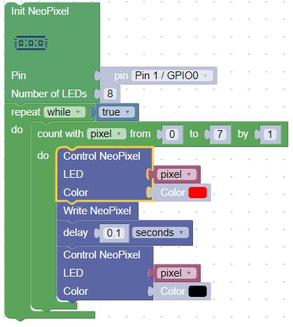
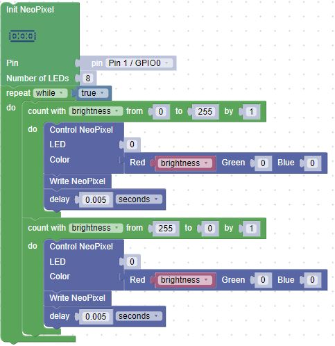

# NeoPixels

NeoPixels are Red-Green-Blue LEDs that are designed to makes them easy to control with three wires: GND, +5V and a single serial data line.  They are very popular with our students because they are powerful, easy to program and full of **bling**.

!!! Note
    As of March of 2022 there is now built-in support for NeoPixels in the MicroPython 1.18 runtime for the Raspberry Pi RP2040 microcontroller.  Although you can still use custom libraries, this tutorial assumes you are using
    version 1.18 or later.

Controlling NeoPixels is challenging since the timing of data being sent must be very precise.  Python alone is not fast enough to send bits out of a serial port.  So a small function that uses assembly code is used.  This code can be called directly from a neopixel driver file so that the user's don't need to see this code.

[MicroPython Example Code on ESP8266](https://docs.micropython.org/en/latest/esp8266/tutorial/neopixel.html)

## Different Types of NeoPixels
There are many different types of NeoPixels.  They come in many forms such as strips, rings and matrices.

The most common type of NeoPixels are strips.  The strips come in a variety of densities and waterproofing.  The most common and easiest to use are the 60 pixels-per-meter type.

## Circuit connections

|LED Strip|Pico Name|Pico Pin|Description|
|---------|---------|--------|-----------|
|GND|GND|38|Ground|Third from top on the right with USB on top|
|5v|VBUS|40|Voltage from the USB bus.  Top right with USB on top|
|Data|GP0|0|Row 1 on the left side|

Note that you can also power most of the LED strips using the 3.3 volts available on Grove connectors.  The only difference is the brightness might not be quite as high, but for most applications this will not be a problem.

## Setup Parameters
Our block will have two parts:

1. Initialization of the NeoPixel object using the static block parameters.  This is also done just once.
2. Sending the drawing commands to the device through the data port.  This is usually done within a main loop.

## Sample Programs
Now we are ready to write our first small test program!

### Move Red Pixel Across Strip

### Fade in and Out
Make the first pixel fade the red color in and out.  We do this by slowly turning up the color level of the red on the NeoPixel.

We start a 0 and go up to 255.  Then we go back from 255 back down to zero.  We delay about 5 milliseconds between each of the 255 brightness levels.

### Heartbeat Lab

What if you were building a robot and you wanted to flash the LED to look like a human heartbeat?  Instead of slowing fading in and out, you would want the brightness to follow the electrical signals coming from the heart.  This is called an electro cardiogram (EKG) and it look like this:

Notice that the signal is low for about one second and then it spikes up to maximum brightness and then comes back down.  When we are moving the brightness up and down, we don't have to pause between each of the 256 brightness values.  The eye can't usually see the intermediate brightness values if the brightness is changing quickly.  To make our code efficient we can skip over 9 out of 10 of the brightness gradations between 0 and 255.

The following blocks emulate this heart beat pattern:

### Move Red, Green and Blue

The following program will just take the blocks in the loop above and move it into a function, then call the function with red, blue, and  green.

### Rainbow Cycle
The program cycles each pixel through all the colors in a rainbow.  It uses two functions:

1. **wheel(pos)** this function takes a position parameter from 0 to 255 and returns a triple of numbers for the red, green and blue values as the position moves around the color wheel.  This is a handy program anytime you want to cycle through all the colors of the rainbow!
2. **rainbow_cycle** will cycle each of the pixels in a strip through the color wheel.  It gives the appearance that colors are moving across the strip.  The wait is the delay time between updating the colors.  A typical value for wait is .05 seconds or 50 milliseconds.

## References

* [MicroPython RP2 Reference for NeoPixel Driver](https://docs.micropython.org/en/latest/rp2/quickref.html#neopixel-and-apa106-driver)
* [Core Electronics: How to use WS2812B RGB LEDs with Raspberry Pi Pico](https://core-electronics.com.au/tutorials/how-to-use-ws2812b-rgb-leds-with-raspberry-pi-pico.html) - HTML page, sample code and video
* [MicroPython Library for NeoPixel (used before version 1.18 of the MicroPython RP2 Runtime)](https://docs.micropython.org/en/latest/library/neopixel.html) - note the lack of support for the RP2040 microcontroller.
* [rp2 port no module named array](https://github.com/micropython/micropython/issues/6837)