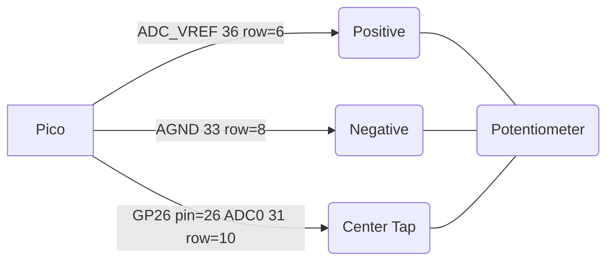
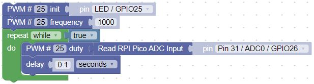

# MicroPython Potentiometer Lab

In this lab we will use a 10K ohm potentiometer to demonstrate how a turn of a knob can result in getting a continuous variable from a user into our code.  We will show how we can use a potentiometer to change the blinking speed of on LED.

## About Analog to Digital Converters

Digital microcontrollers are inherently noisy.  They have clocks that pull power from the power supply and cause voltage fluctuations when we compare a signal to these power lines.  This makes it difficult to get 

ADC_VREF is the ADC power supply (and reference) voltage, and is generated on Pico by filtering the 3.3V supply. This
pin can be used with an external reference if better ADC performance is required.
AGND is the ground reference for GPIO26-29, there is a separate analog ground plane running under these signals and
terminating at this pin.

## Circuit Diagram

1. Connect the top rail of the potentiometer to row 6 which is the ADC_VREF pin.
2. Connect the center tap to row 10 which is ADC0
3. Connect row 8 to the bottom rail of the potentiometer to the Analog Ground (AGND) pin

Note: to get an accurate noise-free reading from the potentiometer you must use the ADC_VREF and the AGND pins.  These are special pins designed to reduce the noise on the power areas of the pico.

## Sample set of blocks To Print Potentiometer Values

Connect the positive to pin 35 ADC_REF (row 6 on the breadboard) and the negative to pin 33 AGND (row 8 on the breadboard).  The Pico has special noise reduction circuits to avoid power supply jitter on these reference pins.

## Changing Blink Speed with a Potentiometer

The following video shows this script in action.
<iframe width="560" height="315" src="https://www.youtube.com/embed/lFfSTOOrsIA" title="YouTube video player" frameborder="0" allow="accelerometer; autoplay; clipboard-write; encrypted-media; gyroscope; picture-in-picture" allowfullscreen></iframe>

## Changing the Brightness of the Built in LED
We can change the brightness of the builtin LED by using the POT value to change the PWM duty cycle.

Here is a sample set of blocks that does this:

