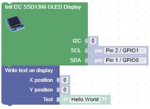
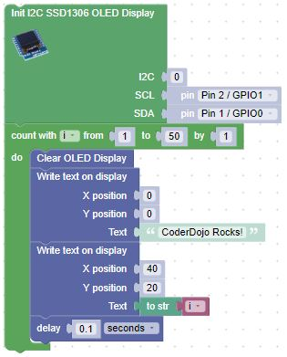
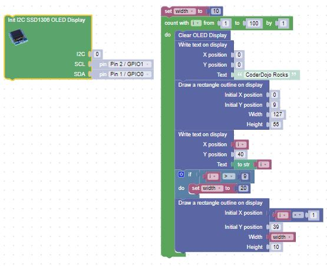

# OLED SSD1306 Examples

## Using the SSD1306 with I2C Interfaces

## Hello World

After this program runs you should see the text on your OLED display.

## Counter Example
In this example we will updated the display 50 times with a 1/10th of a second pause between each refresh.  A counter will cycle from 1 to 50.

## Animated Box
This draws a title and four lines around a drawing area.  It then draws boxes that move to the right.

## References

1. [MicroPython Tutorial on the SSD1306](https://docs.micropython.org/en/latest/esp8266/tutorial/ssd1306.html)

2. [M Fitzp OLED Display i2c Article](https://www.mfitzp.com/article/oled-displays-i2c-micropython/)

3. [Adafruit Stats](https://github.com/adafruit/Adafruit_CircuitPython_SSD1306/blob/master/examples/ssd1306_stats.py)

4. [DIY More OLED Product Description](https://www.diymore.cc/collections/all-about-arduino/products/2-42-inch-12864-oled-display-module-iic-i2c-spi-serial-for-arduino-c51-stm32-green-white-blue-yellow?variant=17060396597306)

5. [Using I2C Defaults](https://github.com/raspberrypi/pico-micropython-examples/blob/master/i2c/1306oled/i2c_1306oled_using_defaults.py)