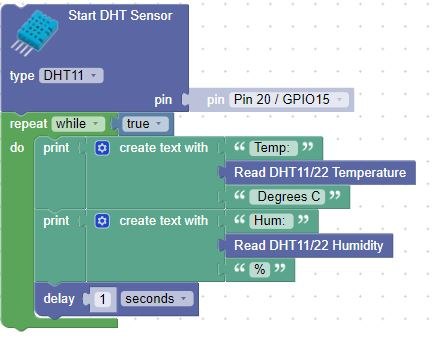

# Sensing Temperature and Humidity with the DHT11 Sensor

## Sample Blocks

## References

* [Peppe80's Example](https://peppe8o.com/dht11-humidity-and-temperature-sensor-with-raspberry-pi-pico-and-micropython/)
* [Axel Örn Sigurðsson's DHT11 Driver](https://raw.githubusercontent.com/ikornaselur/pico-libs/master/src/dht11/dht.py)