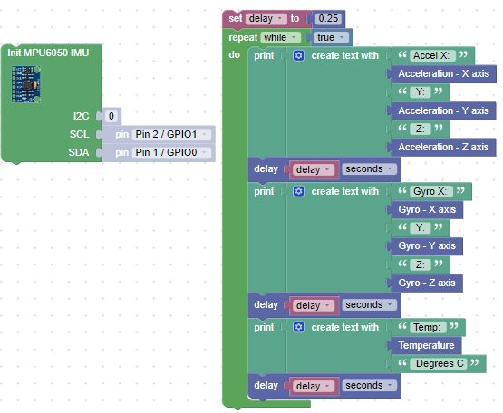

# MPU-6050 Accelerometer Gyroscope Temperature

MPU6050 is a Micro Electro-mechanical system (MEMS), it consists of three-axis accelerometer and three-axis gyroscope. It helps us to measure velocity, orientation, acceleration, displacement and other motion like features.

(Gyro + Accelerometer) MEMS MotionTracking™ Device

* [How the MPU6050 works](https://lastminuteengineers.com/mpu6050-accel-gyro-arduino-tutorial/)

## Pinouts

1. VIN: Voltage Supply Pin
2. GND: 0V Power Supply
3. SCL: I2C Clock Input
4. SDA: I2C Data Input
5. XDO: I2C Data Output
6. XCL: I2C Clock Output
7. ADO: Determines the I2C address of the module
8. INT: Interrupt Output

You only need to hook the 3.3 to VIN, the GND to GND and the SCL and SDA.  The other connections are not needed.

## MPU6050 Drivers and sample blocks

Make sure to load two libraries, the imu library and the vector3d library

