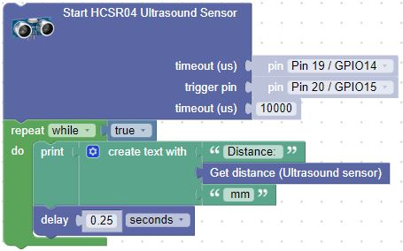

# Ultrasound Ping Sensor
The HC-SR04 is a low cost ($4) sensor that measures the distance to an object in front of it.

## Wiring Diagram

1. Connect GND to any GND pin on the Pico
2. Connnect VCC to VBUS or 5 Volt power
3. Connect Trigger to pin 15.  With USB on the top, this pin is the bottom left corner.
4. Connect Echo to pin 14.  One up from bottom left corner.

## Sample Blocks 

The Ultrasound Ping sensor is found in the left navigation _Sensors: Ultrasound_.  Make sure to load the library for the sensor

