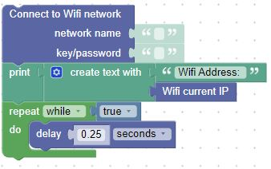
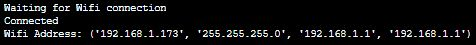
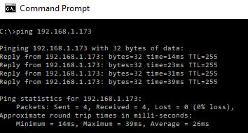

# Connecting to a WiFi Network

Make sure to fill in your network name and password to connect to your WiFi Network.  Then take a look at the console to see the address of the Pico W once it connects to your network.

## Check the console for your connection details

The first part of the connection string is the IP Address of the board.  Next is the network mask, and then the network gateway.  We can ignore everything after the IP Address.  

## Ping the Pico W

Once the connection is up and running, you can open a console window and ping your Pico W (assuming you are on the same network)

