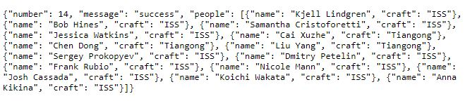
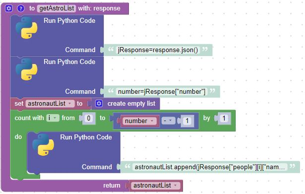
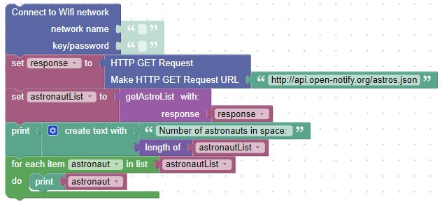
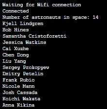

# Getting data from an online API

## Working with HTTP GET

This sample was modified from an example on [Tom's Hardware](https://www.tomshardware.com/how-to/connect-raspberry-pi-pico-w-to-the-internet)

The API call returns a json response.  Unfortunately, BIPES can't process a json, response, so we will have to create a small Python routine to convert the response into a list we can work with.

## The Call and Response

Open a web browser and put the following in as the address: [http://api.open-notify.org/astros.json](http://api.open-notify.org/astros.json).  The json response may be different, depending on when you try it; however, at this time there are 14 astronauts in space as shown in the response:

Fortunately, BIPES has the capability that allows us to run Python code within our blocks.  In this case, we can create a small function to create a list from the json response.  First, convert the response into a json object.  Then extract the number of astronauts on the object.  Finally, create a list of of astronauts and return the list.

Now, lets get the data by connecting to our WiFi network, using the HTTP Get request block, calling our newly created function, and printing the results to the console.  Don't forget to add your WiFi network name and password!

You can see the results in the console window

