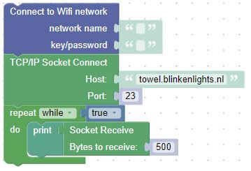
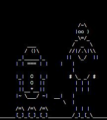

# TCP/IP Socket Connect

## What is a TCP/IP Socket Connection?

A socket programming interface provides the routines required for interprocess communication between applications, either on the local system or spread in a distributed, TCP/IP based network environment. Once a peer-to-peer connection is established, a socket descriptor is used to uniquely identify the connection. The socket descriptor itself is a task specific numerical value.

## Lets watch Star Wars!

Using our WiFi connection and our Pic oW, we can use BIPES to connect to a site that will show Star Wars: The New Hope as ASCII art.  We'll connect to the site towel.blinkenlights.nl on Port 23.  Then we will read data from the site and display the data in the console.  Sit back, relax, and enjoy the movie after entering your WiFi network name and password using the following blocks:

R2-D2 and C3PO as ASCII art in the movie

