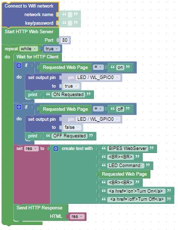
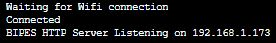
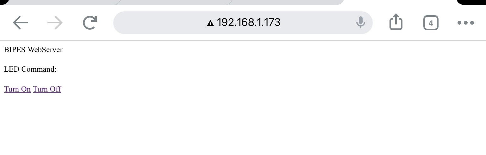

# Creating a Web Server in BIPES

These blocks will turn the Pico W into a small webserver.  The web page has two links in it, one to turn the internal LED on, the other to turn it off.  Make sure to fill in your network name and password to connect to your WiFi Network.  Then take a look at the console to see the address of the webserver once the webserver starts.

## Web Server Blocks

## Check the Console

Take a look at the console to see the address of the webserver once the webserver starts. 

Try the "Soft reset device" button on the console if you get an ENOMEM error when the web server connects. 

## Open a browser and enter the address of the server

Make sure your device is on WiFi!  If you are using your phone, turn off cellular before trying to connect. You should see the following web page:

Click on Turn On to turn on the internal LED.  Click on Turn Off to turn it off.  It may take a few moments after clicking to see the page render and the LED react.  Be Patient!

!!! ChallengeS
The Pico W shares many of the same pins as the Pico.

* Can you use one of the GPIO pins to turn on and off an external LED?

* Can you use one of the ADC pins to read and display a voltage?

* Can you use a display and send a message?